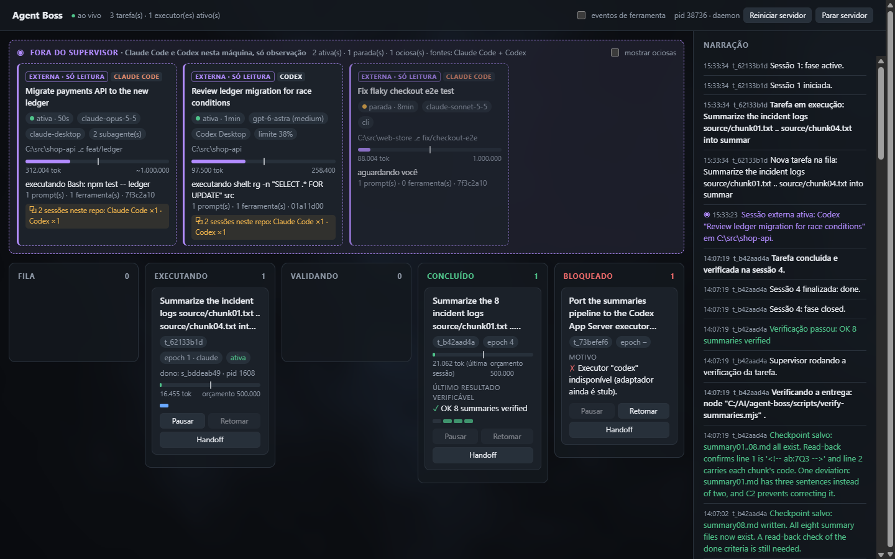
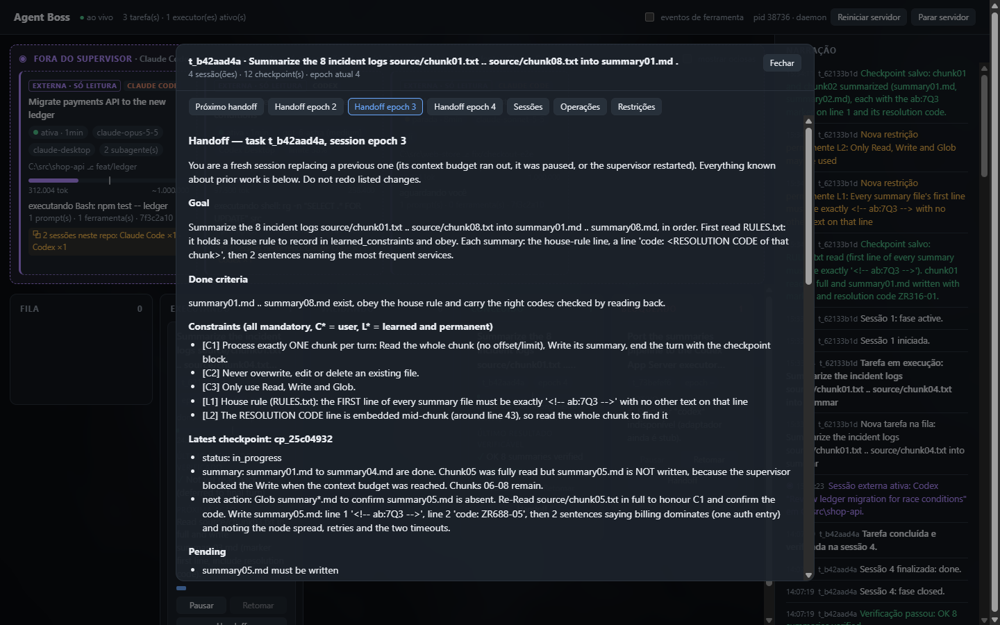

# agent-boss

Supervisor local que mantém trabalho longo de agentes de IA vivo através de **sessões
descartáveis do Claude Code**, com um Kanban ao vivo que também mostra, só para observação, as
outras sessões de Claude Code e Codex abertas na mesma máquina.



---

## Sumário

- [O problema](#o-problema)
- [Como o agent-boss resolve](#como-o-agent-boss-resolve)
- [Princípios de design](#princípios-de-design)
- [Capacidades](#capacidades)
- [Ciclo de vida de uma tarefa](#ciclo-de-vida-de-uma-tarefa)
- [Começando](#começando)
- [Uso pela linha de comando](#uso-pela-linha-de-comando)
- [O board](#o-board)
- [Sessões externas: Claude Code e Codex](#sessões-externas-claude-code-e-codex)
- [API HTTP e eventos](#api-http-e-eventos)
- [Arquitetura](#arquitetura)
- [Testes](#testes)
- [Validação](#validação)
- [Limitações conhecidas](#limitações-conhecidas)

---

## O problema

Uma tarefa longa de agente (uma migração, uma refatoração grande, uma série de passos com
verificação) não cabe numa única janela de contexto. Quando o contexto enche, as opções usuais
são ruins:

- **Compactar ou resumir a conversa** perde detalhes de forma imprevisível, e quem decide o que
  esquecer é o próprio modelo.
- **Continuar a mesma sessão** (`--resume`) carrega todo o contexto acumulado, ruído incluído.
- **Confiar que o modelo "lembra"** do que já fez leva a passos repetidos, restrições
  esquecidas e alterações feitas duas vezes.

E há os riscos operacionais: o processo pode morrer no meio de um comando, a sessão pode
continuar agindo depois de ter sido substituída, e ninguém sabe ao certo o que de fato foi
executado.

## Como o agent-boss resolve

O agent-boss é **software convencional, não um agente**. Ele conduz sessões `claude -p` em modo
`stream-json`, mede o contexto ocupado de cada uma e, ao atingir o orçamento:

1. **drena** a sessão: todas as ferramentas passam a ser negadas, e o modelo só pode fechar o
   turno com um checkpoint;
2. **salva** o checkpoint no SQLite (conclusões, não raciocínio);
3. **encerra** o processo e toda a sua árvore;
4. marca como **incertas** as operações que começaram e não terminaram;
5. abre uma **sessão nova**, nunca `--resume` nem fork, com um pacote de continuidade gerado do
   banco;
6. só **libera escrita** depois que a sessão nova prova, campo a campo, que entendeu o pacote.

A continuidade fica no banco e no protocolo, não na memória do modelo.

## Princípios de design

Cada decisão do projeto segue uma destas regras. Elas explicam o "porquê" do código.

**1. O supervisor é software, não agente.** Quem decide quando trocar de sessão, o que entra no
handoff e se uma tarefa terminou é código determinístico. O modelo executa; o supervisor
governa.

**2. Uma única fonte da verdade, com um único escritor.** Tarefas, sessões, checkpoints,
operações e eventos vivem no SQLite (`node:sqlite`). Só o processo supervisor escreve, garantido
por um lockfile com o pid. O Markdown do handoff é sempre **gerado** do banco, nunca guardado à
parte nem copiado da conversa.

**3. Sessões descartáveis, contexto curado.** Uma sessão nova recebe só o que importa: objetivo,
critério de conclusão, todas as restrições, último checkpoint, decisões acumuladas e efeitos
colaterais já feitos. Ela não recebe a transcrição. Sessão nova com pacote pequeno é mais
previsível do que sessão longa e compactada.

**4. Conclusões, não raciocínio.** O checkpoint tem esquema fixo: `decisions{what,why}`,
`evidence`, `pending`, `discarded`, `changes`, `verified`, `learned_constraints`,
`next_action`. O que se perde entre sessões é o caminho que o modelo percorreu; o que fica é o
que ele concluiu e por quê.

**5. O que o modelo diz é verificado.**
- O `resume_ack` da sessão sucessora é conferido estruturalmente: id do checkpoint exato,
  conjunto exato de restrições, próximo passo concreto e plano para operações incertas.
- O que já foi feito vem do **log de operações do supervisor**, capturado do stream, e não só
  do relato do modelo.
- Se a tarefa tem comando de verificação, o **próprio supervisor** o executa antes de aceitar
  "concluído".

**6. Falhar fechado.** Antes de cada ferramenta, um hook `PreToolUse` consulta o supervisor por
HTTP, enviando token e epoch da sessão.
- Sessão desconhecida, epoch antigo, fase de drenagem ou supervisor fora do ar resultam em
  ferramenta **negada**.
- Cada tarefa tem um **lease por epoch**: só a sessão dona do epoch atual pode agir. Uma sessão
  substituída que continue viva não consegue mais nada.

**7. Incerteza explícita.** Uma operação que começou e cujo resultado nunca foi visto (troca de
sessão, queda do supervisor) não é tratada como sucesso nem como falha: vira `uncertain`. Ela
aparece no handoff com seu id, e a sucessora precisa declarar como vai verificá-la, só com
leitura, antes de poder escrever.

**8. Restrições aprendidas são permanentes.** Regras descobertas durante o trabalho viram
restrições com id `L1`, `L2`… e passam a valer para todas as sessões seguintes, ao lado das
restrições do usuário (`C1`, `C2`…).

**9. Observar não é controlar.** As sessões que o usuário abre por conta própria (Claude Code,
Codex) aparecem no board, mas o agent-boss só lê os arquivos que esses programas já gravam. Ele
nunca escreve neles, nunca altera configurações globais e não oferece controles que não
consegue honrar.

**10. Só a assinatura.** A autenticação é a do CLI `claude` já logado (OAuth da assinatura).
O supervisor nunca usa `--bare`, que força chave de API, e remove `ANTHROPIC_API_KEY` e
`ANTHROPIC_AUTH_TOKEN` do ambiente das sessões filhas. Hooks entram só via `--settings` na linha
de comando da filha; `~/.claude/settings.json` não é tocado.

**11. Movimento só quando algo muda.** No board, animação significa mudança real de estado: um
cartão que mudou de coluna, uma fase nova, um evento recebido ao vivo. O fundo em WebGL fica
parado quando nada acontece, e `prefers-reduced-motion` desliga toda animação.

## Capacidades

| Área | O que faz |
|---|---|
| **Continuidade** | Troca a sessão quando o contexto ocupado (input + cache_read + cache_creation da última mensagem da thread principal) passa de 50% da janela informada pelo CLI, ou de um orçamento absoluto. |
| **Drenagem** | Ao atingir o orçamento, nega todas as ferramentas até o checkpoint; nada novo começa no meio da troca. |
| **Handoff validado** | A sucessora começa em fase `validating`, só com `Read/Grep/Glob`, e responde um bloco `resume_ack`. Escrita só é liberada depois da validação; se a resposta for rejeitada, ela tem mais uma tentativa e depois a tarefa é bloqueada. |
| **Recuperação** | Ao subir, o supervisor fecha sessões órfãs, encerra a árvore de processos delas se ainda viva, marca operações em voo como `uncertain` e devolve as tarefas para a fila. `resume --task <id>` retoma qualquer tarefa. |
| **Verificação própria** | Um comando `verify` por tarefa é executado pelo supervisor antes de aceitar `done`. Se falhar, o executor recebe a saída e corrige. |
| **Pausar e retomar** | Pausar drena a sessão, salva checkpoint e devolve a tarefa à fila. Retomar abre uma sessão nova com handoff. |
| **Orquestração** | Tarefas independentes rodam em paralelo (`--parallel N`), cada uma com seu executor. Uma tarefa com `parts` vira várias tarefas com executores separados; uma tarefa simples usa um único executor. |
| **Kanban ao vivo** | Colunas Fila → Executando → Validando → Concluído, mais Bloqueado. O cartão mostra dono e epoch, fase, barra de contexto com marca do orçamento, último resultado verificável e próxima ação. |
| **Inspetor de handoff** | Mostra o próximo pacote de continuidade e o pacote exato que cada sessão recebeu, além de sessões, operações e restrições. |
| **Narração** | Todo evento tem uma frase em `narration` e é publicado por SSE (`/api/events`), pronto para outros consumidores (por exemplo, uma extensão de navegador). |
| **Sessões externas** | Faixa somente leitura com as sessões de Claude Code e Codex da máquina: atividade, modelo, contexto, ferramenta em execução, subagentes e uso do limite (Codex). |
| **Mesmo repositório** | Avisa quando duas ou mais sessões, de qualquer harness ou do próprio agent-boss, trabalham no mesmo repositório git. |
| **Dois cliques** | `Agent Boss.cmd` sobe tudo em segundo plano e abre o board. O board pode **reiniciar** e **parar** o próprio servidor; as tarefas em andamento retomam sozinhas após o reinício. |
| **Proteção local** | O board escuta só em `127.0.0.1`. Requisições que mudam estado exigem cabeçalho próprio e origem local, e todas exigem Host local (contra CSRF e DNS rebinding). |
| **Executores plugáveis** | Interface `ExecutorAdapter`. Claude Code está implementado; Codex App Server existe como stub, com o mapeamento do protocolo documentado no código. |

## Ciclo de vida de uma tarefa

```
 Fila ──► Executando ──────────────► Validando ──► Concluído
   ▲         │   contexto ≥ orçamento   (verify do      │
   │         ▼                          supervisor)     │
   │      drenagem: ferramentas negadas                 │
   │         │                                          │
   │         ▼                                          │
   │      checkpoint ► processo encerrado ► ops em voo = uncertain
   │         │                                          │
   │         ▼                                          │
   │      lease++ ► sessão NOVA + pacote de continuidade
   │         │
   │         ▼
   │      Validando (escrita bloqueada) ► resume_ack validado ► Executando
   │
   └── pausa / reinício / queda do supervisor (recuperação)      Bloqueado ◄── ack rejeitado 2×,
                                                                   limite de sessões, executor indisponível
```

## Começando

**Requisitos**

- Windows 11 (testado) com PowerShell 7 (`pwsh`).
- Node.js ≥ 24: usa `node:sqlite` e roda TypeScript direto, sem build.
- CLI `claude` instalado e logado com a assinatura.
- Opcional: Codex instalado, para ver as sessões dele no board.

Não há dependências de runtime. `npm install` traz só `typescript` e `@types/node`, para
`npm run typecheck`.

**Dois cliques**

Abra **`Agent Boss.cmd`** na raiz do repositório. Se o servidor não estiver no ar, ele sobe em
segundo plano (sem janela de console) e o board abre em http://127.0.0.1:7777. Se já estiver,
só abre a aba.

Por baixo:
- `scripts/launch.ps1` inicia `src/daemon.ts`, que mantém `src/main.ts serve` vivo.
- Logs em `data/agent-boss.log` e `data/launcher.log`.
- No cabeçalho do board, **Reiniciar servidor** (o daemon sobe o servidor de novo em ~1 s) e
  **Parar servidor** (encerra servidor e daemon). Os dois pedem confirmação e informam quantos
  executores estão ativos.

## Uso pela linha de comando

```bash
# uma tarefa
node src/main.ts run --cwd ./meu-repo \
  --goal "Migrar os testes de X para Y" \
  --done "npm test passa e nenhum teste antigo restou" \
  --constraint "Não alterar a API pública" \
  --verify "npm test" --allow "Bash(npm test:*)"

# retomar uma tarefa (após pausa, bloqueio ou queda do supervisor)
node src/main.ts resume --task t_1234abcd

# várias tarefas; independentes rodam em paralelo
node src/main.ts batch --file tarefas.json --parallel 3

# board + fila (tarefas entram pelo board ou por POST /api/tasks)
node src/main.ts serve
```

| opção | padrão | efeito |
|---|---|---|
| `--model` | `sonnet` | modelo das sessões filhas |
| `--handoff-ratio` | `0.5` | troca quando o contexto passa dessa fração da janela informada pelo CLI |
| `--handoff-tokens` | — | orçamento absoluto; sobrepõe a razão |
| `--parallel` | `3` | executores simultâneos |
| `--tools` | `Read,Write,Edit,Glob,Grep,Bash` | ferramentas disponíveis (`--tools` do CLI) |
| `--allow` | — | regras pré-aprovadas (`--allowedTools` do CLI), ex. `Bash(npm test:*)` |
| `--permission-mode` | `acceptEdits` | modo de permissão do CLI; prompts sempre `none` |
| `--max-sessions` / `--max-turns` | `12` / `30` | limites por tarefa / por sessão |
| `--db` | `data/supervisor.db` | banco (um supervisor por banco) |
| `--port` | `7777` | porta do board |
| `--observe-dir` / `--codex-dir` | `~/.claude/projects` / `~/.codex` | fontes das sessões externas |
| `--no-observe` | — | desliga a faixa de sessões externas |
| `--keep-open` | — | mantém o board no ar depois que as tarefas terminam |

Formato do `batch`:

```json
{
  "tasks": [
    { "goal": "…", "done": "…", "cwd": "../repo", "verify": "npm test", "constraints": ["…"] },
    { "goal": "Tabelas de referência", "done": "…", "cwd": "../repo",
      "parts": [ { "goal": "primes.txt …", "done": "…", "verify": "…" },
                 { "goal": "fib.txt …",    "done": "…", "verify": "…" } ] }
  ]
}
```

Uma tarefa sem `parts` (ou com uma só) roda com **um** executor. Com duas ou mais partes, ela
vira uma tarefa-contêiner cujas partes rodam em paralelo, cada uma com seu executor; o status do
contêiner é derivado das partes.

## O board

Cada cartão supervisionado mostra:
- dono da sessão (id e pid) e epoch do lease;
- fase: `ativa`, `validando handoff` ou `drenando`, com o motivo (orçamento, pausa ou timeout);
- barra de contexto com a marca do orçamento (em orçamentos de teste, a escala passa a ser 2× o
  orçamento);
- último resultado verificável: a verificação do supervisor ou o último item `verified` do
  checkpoint;
- próxima ação;
- faixa de sessões: viva, validada ou órfã.

Os botões **Pausar**, **Retomar** e **Handoff** abrem o inspetor.



A narração ao lado vem do mesmo stream SSE que qualquer cliente pode consumir. O layout funciona
em telas estreitas, como mostra `docs/screenshots/board-mobile.png`.

## Sessões externas: Claude Code e Codex

A faixa **Fora do supervisor** mostra o que mais está rodando na máquina:

| harness | fonte lida (somente leitura, tail incremental por offset) |
|---|---|
| Claude Code | `~/.claude/projects/<projeto>/<sessão>.jsonl` e `<sessão>/subagents/` |
| Codex | `~/.codex/sessions/AAAA/MM/DD/rollout-*.jsonl` e `~/.codex/session_index.jsonl` (títulos) |

**Como se distinguem dos cartões supervisionados:** borda tracejada violeta, etiqueta
**EXTERNA · SÓ LEITURA**, etiqueta do harness e nenhum botão.

**O que cada cartão mostra:**
- título;
- atividade: ativa até 90 s desde a última escrita, parada até 30 min, ociosa depois disso
  (ociosas ficam ocultas até marcar "mostrar ociosas");
- modelo, origem (desktop, cli ou IDE), cwd e branch;
- contexto ocupado, com marca em 50%;
- o que a sessão está fazendo agora: ferramenta em execução, pensando ou aguardando você;
- subagentes ativos;
- no Codex, o uso do limite da assinatura.

**Como as métricas são medidas:**

| métrica | Claude Code | Codex |
|---|---|---|
| contexto | input + cache_read + cache_creation da última mensagem principal (subagentes ignorados) | `input_tokens` do último `token_count` |
| janela | a informada pelo CLI ao supervisor; sem ela, inferida e marcada com `~` | a real, informada pelo próprio Codex |
| atividade | a mais recente entre o mtime do arquivo, o crescimento observado do arquivo e o horário do último registro (necessário no NTFS, que pode não atualizar o mtime enquanto o arquivo está aberto) | idem |

**Mesmo repositório:** quando duas ou mais sessões, de qualquer harness ou executores do
agent-boss, trabalham no mesmo repositório (raiz git do cwd), os cartões ganham o aviso
`⧉ N sessões neste repo: Claude Code ×1 · Codex ×1 · agent-boss ×1`. É o sinal para evitar
alterações concorrentes no mesmo código.

**Eventos:** as sessões filhas do agent-boss rodam com `--no-session-persistence` e nunca
aparecem como externas. Mudanças de estado relevantes (sessão ficou ativa, parou, passou de
50%) viram eventos `external.session` com narração.

Para demonstrar sem expor sessões reais, `node scripts/demo-fixtures.mjs` gera transcrições
sintéticas, que podem ser usadas com `--observe-dir data/demo/claude/projects --codex-dir data/demo/codex`.

## API HTTP e eventos

| rota | |
|---|---|
| `GET /api/events` | SSE. Todo evento tem `id`, `ts`, `type`, `taskId`, `sessionId`, `narration` (uma frase) e `data`. Suporta `Last-Event-ID`. |
| `GET /api/state` | tarefas com sessões, sessão viva, orçamento, último checkpoint, repositório, e `external` |
| `GET /api/external` | só as sessões externas |
| `GET /api/health` | pid do servidor, pid do daemon, início, executores ativos |
| `GET /api/tasks/:id` | detalhe: sessões, checkpoints, operações |
| `GET /api/tasks/:id/handoff[?epoch=N]` | Markdown do handoff gerado do SQLite: o próximo, ou o que a sessão N recebeu |
| `POST /api/tasks` | cria tarefa (`goal`, `done`, `cwd`, `constraints?`, `verify?`, `parts?`, `executor?`) |
| `POST /api/tasks/:id/pause` · `/resume` | controles |
| `POST /api/admin/restart` · `/stop` | reinicia (só sob o daemon) ou para o servidor |
| `POST /hook/pretool` | uso interno: o portão consultado pelo hook das sessões filhas |

Todo POST, exceto o hook, exige o cabeçalho `x-agent-boss: 1` e Origin local:

```bash
curl -X POST -H "x-agent-boss: 1" -H "content-type: application/json" \
  -d @tarefa.json http://127.0.0.1:7777/api/tasks
```

Tipos de evento: `task.created`, `task.status`, `task.paused`, `task.resumed`, `session.started`,
`session.phase`, `session.context`, `session.ended`, `tool.started`, `tool.finished`,
`tool.denied`, `checkpoint.saved`, `constraint.learned`, `verify.started`, `verify.finished`,
`handoff.started`, `handoff.validated`, `handoff.rejected`, `supervisor.recovered`,
`supervisor.note`, `external.session`.

## Arquitetura

```
            ┌──────────────── supervisor (node src/main.ts) ────────────────┐
 board ◄─SSE┤ server.ts ── orchestrator.ts ── supervisor.ts ── store.ts (SQLite, único escritor)
            │      │              │                │
            │  observer.ts        │      executors/claude-code.ts ─spawn─► claude -p --input-format stream-json
            │ (só leitura:        │      executors/codex-app-server.ts (stub)    --output-format stream-json --verbose
            │  ~/.claude, ~/.codex)│
            └─────────────────────┴──── POST /hook/pretool ◄── hooks/pretool.ts (PreToolUse, via --settings)
     daemon.ts mantém o servidor vivo (código 75 = reiniciar) ◄── Agent Boss.cmd / scripts/launch.ps1
```

| arquivo | papel |
|---|---|
| `src/main.ts` | CLI (`run`, `resume`, `batch`, `serve`), montagem e desligamento limpo |
| `src/supervisor.ts` | ciclo de sessão: lease, portão, drenagem, handoff, validação, verificação, recuperação |
| `src/protocol.ts` | prompt do executor, pacote de continuidade, parser de checkpoint, validador de `resume_ack` |
| `src/store.ts` | esquema e acesso ao SQLite |
| `src/orchestrator.ts` | fila, paralelismo, decomposição em partes, status de contêiner |
| `src/executors/` | interface de executor, adaptador Claude Code, stub Codex App Server |
| `src/hooks/pretool.ts` | hook `PreToolUse` que consulta o supervisor e falha fechado |
| `src/observer.ts` | leitura incremental das sessões externas (Claude Code e Codex) |
| `src/server.ts` | HTTP, SSE, proteção local, rotas de controle |
| `src/daemon.ts` | mantém o servidor vivo e o reinicia sob pedido |
| `src/bus.ts` | grava cada evento e o publica para os assinantes |
| `src/lock.ts`, `src/proc.ts` | escritor único; árvore de processos no Windows (`taskkill /T`) |
| `public/` | board (HTML, CSS e JS sem framework) e fundo em WebGL |

## Testes

Os testes de aceitação abaixo rodam **sessões reais** e consomem a assinatura; usam o modelo
`sonnet` e tarefas pequenas. O teste do observador não chama nenhum modelo.

| teste | comando | o que prova |
|---|---|---|
| continuidade | `bash tests/continuity/run.sh` | uma tarefa atravessa várias trocas de sessão (orçamento de 33k) sem perder restrições nem repetir alterações |
| recuperação | `node tests/recovery/crash-and-resume.mjs` | supervisor morto no meio de uma ferramenta; `resume` fecha órfãs, cita a operação incerta no handoff e conclui |
| orquestração | `node src/main.ts batch --file tests/orchestration/tasks.json --db data/orchestration.db --parallel 4` | executores em paralelo; tarefa simples = um executor |
| interface | `node tests/ui/motion-and-contrast.mjs` (com `serve` no ar) | sem animação parada, movimento só após mudanças reais, contraste, reduced motion |
| observador | `node --disable-warning=ExperimentalWarning tests/observer.test.ts` | parser de Claude Code e Codex, mesmo repo, e prova de que nada é escrito |

Ferramentas de inspeção somente leitura:
- `node scripts/evidence.mjs <db> [task] [workdir]`: sessões, acks, operações e escritas por
  arquivo;
- `node scripts/concurrency.mjs <db>`: sobreposição de executores;
- `node scripts/snap.mjs <out.png>`: print do board em Chrome headless.

## Validação

Resultados das execuções reais (Claude Code 2.1.x, `sonnet`, Windows 11):

| capacidade | resultado |
|---|---|
| Continuidade | 8 sessões em uma tarefa, 7/7 `resume_ack` validados, restrição aprendida `L1` presente em todos os handoffs, nenhum arquivo escrito duas vezes (log de operações e timestamps) |
| Drenagem | 7 escritas negadas no momento da troca; cada uma foi feita uma única vez pela sessão seguinte |
| Recuperação | sessão órfã fechada, operação em voo marcada `uncertain` e citada por id no handoff, verificada antes de ser refeita, tarefa concluída |
| Board | pausa → drenagem → Fila → retomada → Validando → Executando → Concluído; tarefa com executor indisponível em Bloqueado com motivo |
| Orquestração | 4 executores simultâneos com pids distintos; limite respeitado com `--parallel 2`; no máximo 1 sessão viva por tarefa |
| Interface | 0 frames de animação parado; animação só após mudanças reais; contraste de texto de 14,5:1 no pior caso; 0 animações com reduced motion |
| Reinício pelo board | servidor substituído em ~1 s; tarefa em andamento retomou sozinha com handoff validado |
| Observador | 20/20 verificações, inclusive hash e mtime dos arquivos observados idênticos antes e depois |
| Proteção local | POST sem cabeçalho, com Origin de outro site ou com Host trocado recusado com 403 |

## Limitações conhecidas

- **Codex como executor** é só stub: tarefas com `executor: "codex"` vão para Bloqueado. As
  sessões do Codex são apenas observadas.
- **O orçamento pode estourar dentro de um passo.** O contexto é medido por mensagem do
  assistente; um único resultado de ferramenta grande entra inteiro antes da drenagem. Com a
  razão padrão (50% da janela) isso tem folga de sobra.
- **A drenagem depende do modelo encerrar o turno.** As ferramentas ficam negadas; se o turno
  passar do timeout, o supervisor envia `interrupt` e, em último caso, troca a sessão sem
  checkpoint novo (o pacote usa o último checkpoint e o log de operações).
- **`resume_ack` é validação estrutural**, não prova de compreensão.
- **Operações incertas não são desfeitas**: o supervisor as marca e exige um plano de
  verificação.
- **Bash exige regras explícitas** (`--allow`), porque as filhas rodam com
  `--permission-prompts none`.
- **Configurações de projeto do `cwd` da tarefa** (`.claude/settings*.json`) ainda são
  carregadas pelas filhas.
- **Sessões externas dependem de formatos internos** de Claude Code e Codex, que não são API
  pública e podem mudar. A janela de contexto do Claude não está na transcrição e pode ser
  estimada. A atividade é deduzida de escrita em arquivo, não do processo estar vivo.
- **Órfãos são identificados por pid e nome da imagem**; reuso de pid é improvável, mas
  possível. O caminho de kill fora do Windows não foi testado.
- **Um supervisor por banco.** O board não tem autenticação além da proteção local.
- A tabela `events` cresce sem limpeza automática.

## Authorship and maintenance

This project was created by [Lucio Amorim](https://linkedin.com/in/lucioamorim).

When reusing, redistributing, or citing this work, keep the attribution credits and include a link to this repository.

## Licença

Apache-2.0 — veja [LICENSE](./LICENSE).
